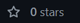

# Markdown README generator

## Description
As part of module 9 assignment, being a developer we have to build a **README.md** generator using node.js.
This generator will saves time to create a read-me markdown file, it includes default questions, choices and icon badges for certain license.

## Table of Contents
1. [Installation](#installation-details)
2. [Usage](#screenshots-demo-video)
3. [Reference](#reference-and-credits)
4. [Github Link](#github-username)
5. [Feedback or Contribute](#ask-question-or-how-to-contribute)
6. [License](#license-type)

## Installation
* Clone the ***starter code***, from this [repository](https://github.com/coding-boot-camp/potential-enigma)
* Create new folder and copy the files inside the develop folder
* Install an additional npm package, ***--npm i inquirer@8.2.4***
* Open your git terminal and create a new repository for this assignment then ***init > add > commit > remote add origin > push***
* Create new demo README.md file for mock-up, output folder and add any necessary assets in your utils folder
* Using ***index.js*** create pseudo code and start adding the inquirer prompt and function to create the generated demo-md markdown file.
* ***md-generator.js*** create function for the object placeholder and this function will export object values in every questions.

## Usage
***To view the demo video*** , please click the link
[demo-video](https://drive.google.com/file/d/18iKZPEcEKmpUBZQpD1tL39dcVKNrt8yb/view?usp=sharing)

## Reference
Here are the list of reference for this assignment, [Starter Code](https://github.com/coding-boot-camp/potential-enigma), [Buy me a coffee icon](https://www.buymeacoffee.com/downloads), [License Badge](https://shields.io/), [Xbox Game Bar](https://apps.microsoft.com/store/detail/xbox-game-bar/9NZKPSTSNW4P?hl=en-au&gl=AU), to record the demo video and instructors ***Sam*** guided syntax code.

## Github Link
You might be a shooting star &#9733; Don't forget to click the  button on any of my repositories [github/maytiara](https://github.com/maytiara)

## Feedback or Contribute
***If you have any feedback or suggestion feel free to send an email,*** maytiara@gmail.com
***Or else, if you would like to make a contribution, feel free to***  

## License
All rights reserved. Under the MIT license.
